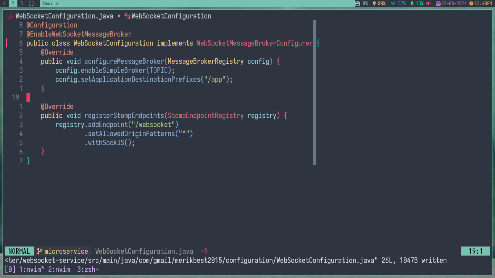
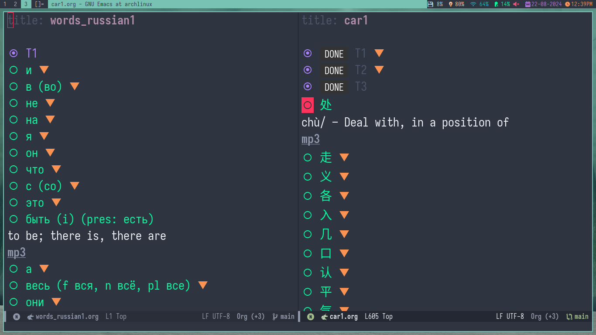
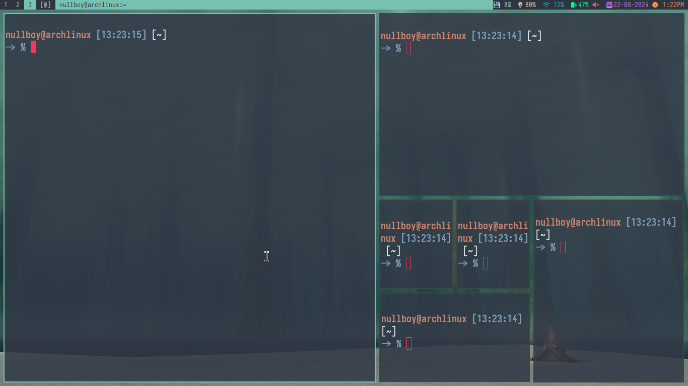

## nvim
Personal configuration for java, go and js. To use my Java configuration, change 
the paths in `ftplugin/java.lua` and download:
- [jdtls](https://download.eclipse.org/jdtls/milestones/?d) Current version is 1.37.0
- Install with Mason [java-debug](https://github.com/microsoft/java-debug) or:
  1. git clone
  2. run `./mvnw clean install`
- Install [java-test](https://github.com/microsoft/vscode-java-test) with Mason or:
  1. git clone
  2. run `npm install`
  3. run `npm run build-plugin`

## emacs
My emacs configuration for language learning(chinese, russian and english) idk
check the config is lisp lol

## dwm & dwmblocks
The definitive window manager

